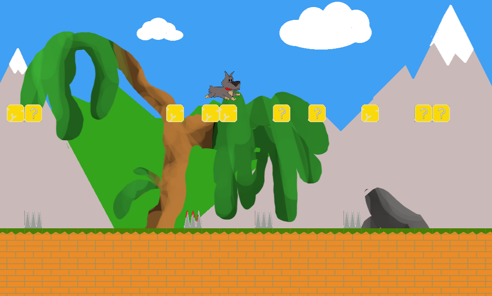

# TilePlatformerGame

## A mario style side scrolling platformer using Love2D

Portos is my dog, he's crazy, really, like certifiably. He will chase just about anything, frisbees, cats, deer and to the limits of my patience he never tires of doing so. This is exactly the reason why he belongs in a video game!

A work in progress, join Portos on his quest to retrieve the bones. I have created a level maker and hope to develop the game to follow a narrative and include boss fights.

It is easy to create, test and save levels locally using the levelmaker, it would be nice to have an easy way to share save files too and encourage social interaction within the game.

https://user-images.githubusercontent.com/109744044/198512636-62897273-da5e-4a44-863e-ee1e7830795e.mp4

I decided having the option to traverse both upwards and forwards might lead to interesting scenarios. I think there is potential for airborne escapades and of course it gives level builders more creative freedom.

https://user-images.githubusercontent.com/109744044/198512651-694e51b2-eda7-484e-80b9-900d7293ff06.mp4

At the moment I am implementing two game modes, kill the squirrels(although there will be a reckoning) and find the bone but I am considering ways to encourage players to explore the level more, similar to a key and lock but more suitable for Portos, collect the toys to open the door?

